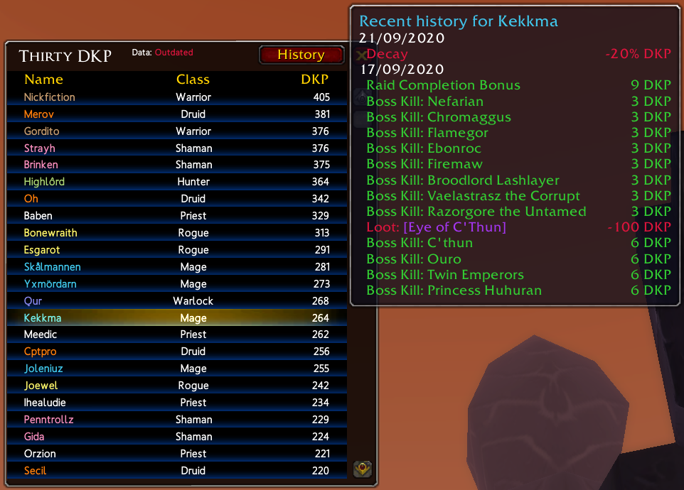
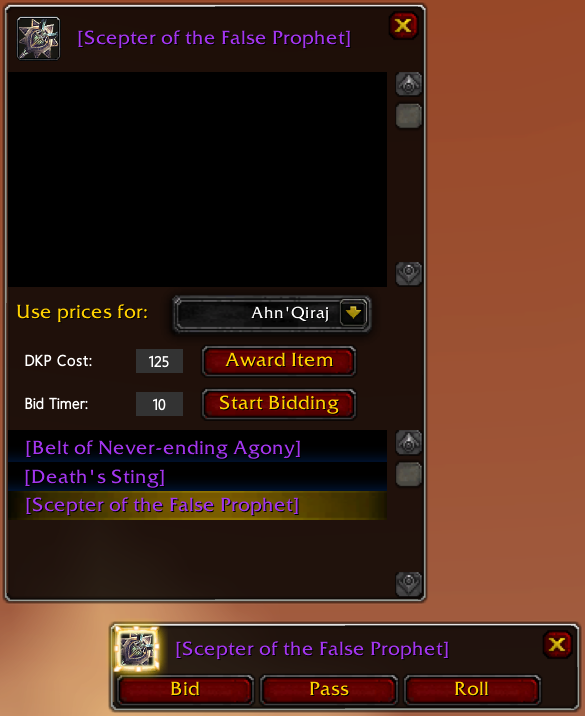

# ThirtyDKP

A simple, lightweight and efficient DKP and DKP management addon for World of Warcraft Classic.
Built around static price bidding with weekly decay (this is the only mode currently supported, and probably the only mode that will be supported)

This addon is made for, and by, the guild Essential on Gehennas-EU.
We are developing this addon as a side project to fulfill the needs of our guild. Although, it is not bound to our guild in any way so there is nothing blocking others from using it as long as they understand the english language. 

## How to use

To bring up the main window with the dkp table. Where everyone can view their DKP and admins can manage the addon:

/thirtydkp  or  /tdkp

To bring up the bidding window where you auction out items for DKP:

/tdkp bid  or  /tdkp bid [itemlink]

